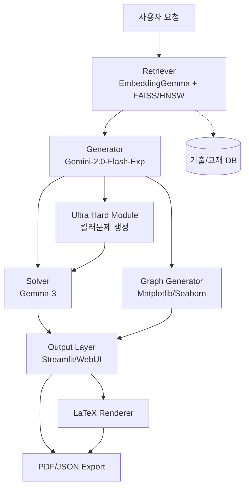

# 🎓 한국 수능 수학 AI 문제 생성 시스템

## 1. 개요
본 시스템은 한국 대학수학능력시험(수능) 스타일의 수학 문제를 자동 생성하고, 풀이와 해설까지 제공하는 AI 문제 생성 파이프라인입니다.

### 핵심 모델
- **문제 출제**: Gemini-2.0-Flash-Exp (최신 모델)
- **풀이/증명**: Gemma-3 (12B/27B)
- **검색/참고자료 임베딩**: EmbeddingGemma

### 주요 특징
- 🚀 **클라우드 배포 지원**: Docker 및 Google Cloud Run 지원
- 📊 **그래프 생성**: 수학 함수 그래프 및 기하 도형 자동 생성
- 🎯 **초고난도 문제**: 킬러 문제 전문 생성 모듈
- 📚 **교육과정 대응**: 2015/2022 교육과정 모두 지원
- 🎨 **LaTeX 렌더링**: 수식 완벽 지원

## 2. 목표
- ✅ 실제 수능과 유사한 형식의 문제 생성 (선택형/단답형)
- ✅ 난이도, 주제, 배점 등 세밀한 설정 가능
- ✅ 정답 + 풀이 + 해설까지 포함한 완결된 문제 제공
- ✅ 기출/교재 데이터를 기반으로 한 신뢰도 높은 문제 출제
- ✅ 그래프 및 도형을 포함한 시각적 문제 생성
- ✅ 초고난도 킬러 문제 자동 생성
- ✅ 클라우드 환경 원클릭 배포

## 3. 시스템 아키텍처

### 3.1 아키텍처 개요



### 3.2 데이터 흐름
1. **사용자 입력**: 문제 생성 요청 (예: "미적분, 상 난이도, 선택형")
2. **Retriever**: EmbeddingGemma로 쿼리와 코퍼스 문항 임베딩 → FAISS 검색
3. **Generator**: Gemini-2.0-Flash-Exp가 검색된 문항을 변형·조합해 신규 문제 출제
4. **특수 모듈 활성화**:
   - Graph Generator: 그래프/도형이 필요한 경우 자동 생성
   - Ultra Hard Module: 킬러 문제 요청 시 활성화
5. **Solver**: Gemma-3가 문제를 풀이하고 해설 생성
6. **LaTeX Rendering**: 수식 및 문제 텍스트 렌더링
7. **Output**: Streamlit UI에 문제/정답/해설 표시 + PDF 다운로드

## 4. 주요 모듈

### 4.1 데이터베이스 모듈
- **입력 형식**: JSONL (`{"id": "...", "text": "..."}`)
- **검색 방식**: EmbeddingGemma → 벡터화 → FAISS 인덱스 구축
- **지원 기능**:
  - Top-k 검색
  - 문단/청크 단위 색인
  - L2 또는 Cosine 유사도 기반

### 4.2 문제 생성 모듈
#### 기본 생성기 (Gemini-2.0-Flash-Exp)
- **입력**: 검색된 기출/참고자료 + 사용자 조건(주제, 난이도, 배점, 형식)
- **출력**: 문제 지문, 보기, 정답
- **교육과정**: 2015/2022 교육과정 자동 감지 및 적용

#### 초고난도 생성기 (Ultra Hard Generator)
- **특징**: 킬러 문제 전문 생성
- **기법**: 복합 개념 융합, 역발상 문제, 극한 케이스
- **난이도 보정**: 자동 난이도 스케일링

#### 그래프 생성기 (Graph Generator)
- **지원 유형**:
  - 삼각함수 그래프
  - 다항함수/지수/로그 그래프
  - 기하 도형 (원, 타원, 쌍곡선)
  - 벡터 다이어그램
- **출력 형식**: Base64 인코딩된 이미지

### 4.3 풀이/증명 모듈 (Gemma-3)
- **입력**: 문제 텍스트 + 정답
- **출력**:
  - 단계별 풀이 과정
  - 증명 및 수학적 설명
  - 최종 해설

### 4.4 UI 모듈 (Streamlit)
- **기능**:
  - 단일 문제 생성
  - 모의고사 세트 생성
  - 킬러 문제 전용 모드
  - 그래프 포함 문제 생성
  - 결과 PDF 다운로드 (LaTeX/ReportLab 활용)
  - 난이도, 유형, 주제 선택 인터페이스
  - 교육과정 선택 (2015/2022)

### 4.5 LaTeX 렌더링 모듈
- **기능**:
  - 한글-수식 혼합 텍스트 완벽 처리
  - Streamlit 전용 렌더링 최적화
  - PDF 출력용 LaTeX 변환

## 5. 기술 스택
| 구성요소 | 기술 |
|---------|------|
| 임베딩 | EmbeddingGemma (HuggingFace Transformers, PyTorch) |
| 생성 모델 | Gemini-2.0-Flash-Exp (Google Generative AI API) |
| 풀이 모델 | Gemma-3 (HuggingFace Transformers, PyTorch) |
| DB/검색 | FAISS (CPU/GPU 버전 선택) |
| 웹/UI | Streamlit |
| PDF 출력 | PyLaTeX, ReportLab |
| 그래프 생성 | Matplotlib, Seaborn, NumPy |
| 컨테이너 | Docker |
| 클라우드 | Google Cloud Run |

## 6. 성능 및 최적화
- **임베딩 차원**: 768 (MRL 사용 시 128/256/512로 축소 가능)
- **검색 속도**: 약 100k 문항 색인 시 < 100ms (FAISS HNSW)
- **문제 생성 속도**: Gemini API 호출 → 평균 2~5초
- **풀이 생성 속도**: Gemma-3 12B 기준 GPU 환경에서 수 초~수십 초

## 7. 설치 및 실행

### 7.1 환경 설정
```bash
# 저장소 클론
git clone https://github.com/yourusername/ksat-math-ai.git
cd ksat-math-ai

# 가상환경 생성 및 활성화
python -m venv venv
source venv/bin/activate  # Windows: venv\Scripts\activate

# 패키지 설치
pip install -r requirements.txt
```

### 7.2 API 키 설정
```bash
# .env 파일 생성
cp .env.example .env

# .env 파일에 API 키 입력
GEMINI_API_KEY=your_gemini_api_key
HUGGINGFACE_TOKEN=your_huggingface_token
```

### 7.3 데이터베이스 구축
```bash
# 기출문제 데이터 준비
python scripts/prepare_data.py

# FAISS 인덱스 구축
python scripts/build_index.py
```

### 7.4 실행

#### 로컬 실행
```bash
# Streamlit 앱 실행
streamlit run src/ui/app.py
```

#### Docker 실행
```bash
# Docker 이미지 빌드
docker build -t ksat-math-ai .

# 컨테이너 실행
docker run -p 8501:8501 --env-file .env ksat-math-ai
```

#### Cloud Run 배포
```bash
# 빠른 배포 스크립트
./scripts/deploy.sh

# 또는 수동 배포
gcloud run deploy ksat-math-ai \
  --source . \
  --region asia-northeast3 \
  --allow-unauthenticated
```

## 8. 프로젝트 구조
```
ksat-math-ai/
├── src/
│   ├── core/               # 핵심 모듈
│   │   ├── config.py       # 설정 관리
│   │   ├── problem_generator.py  # 메인 생성기
│   │   └── curriculum_2015.py    # 2015 교육과정
│   ├── retriever/          # 검색 모듈
│   │   ├── embedder.py     # EmbeddingGemma 래퍼
│   │   ├── indexer.py      # FAISS 인덱싱
│   │   └── searcher.py     # 검색 인터페이스
│   ├── generator/          # 문제 생성 모듈
│   │   ├── gemini_client_v2.py   # Gemini 2.0 클라이언트
│   │   ├── problem_generator.py  # 기본 생성기
│   │   ├── problem_generator_2015.py  # 2015 교육과정
│   │   └── ultra_hard_generator.py    # 킬러문제 생성기
│   ├── generators/         # 특수 생성 모듈
│   │   ├── graph_generator.py    # 그래프 생성
│   │   ├── latex_renderer.py     # LaTeX 렌더링
│   │   ├── pdf_generator.py      # PDF 출력
│   │   └── ultra_hard_problems.py # 초고난도 템플릿
│   ├── solver/             # 풀이 모듈
│   │   ├── gemma_solver.py       # Gemma 풀이기
│   │   └── solution_formatter.py # 해설 포맷터
│   ├── ui/                 # UI 모듈
│   │   ├── app.py          # Streamlit 메인
│   │   └── components/     # UI 컴포넌트
│   └── utils/              # 유틸리티
│       └── helpers.py      # 헬퍼 함수
├── scripts/                # 배포 및 유틸리티 스크립트
│   ├── deploy.sh           # Cloud Run 배포
│   └── prepare_data.py     # 데이터 준비
├── tests/                  # 테스트
│   └── test_ultra_hard_fixes.py
├── Dockerfile              # Docker 설정
├── cloudbuild.yaml         # Cloud Build 설정
├── requirements.txt        # 의존성
├── DEPLOY.md              # 배포 가이드
└── README.md              # 프로젝트 문서
```

## 9. 사용 방법

### 9.1 단일 문제 생성
1. 웹 UI에서 문제 조건 설정
2. 교육과정 선택 (2015/2022)
3. 유사 기출문제 검색 결과 확인
4. 생성된 문제 및 풀이 검토
5. JSON/PDF로 다운로드

### 9.2 킬러 문제 생성
1. "초고난도 문제" 모드 선택
2. 융합 개념 및 문제 유형 선택
3. 난이도 레벨 설정 (27-30번 수준)
4. 생성 및 검증

### 9.3 그래프 포함 문제 생성
1. 그래프 타입 선택 (함수, 도형, 벡터)
2. 파라미터 설정
3. 그래프 자동 생성 및 문제 통합

### 9.4 모의고사 세트 생성
1. 문제 수 및 배점 분포 설정
2. 킬러 문제 포함 여부 선택
3. 모의고사 생성 (약 3-5분 소요)
4. 전체 문제 세트 PDF 다운로드

## 10. 클라우드 배포

### Google Cloud Run
```bash
# 사전 준비
gcloud auth login
gcloud config set project YOUR_PROJECT_ID

# 배포
gcloud run deploy ksat-math-ai \
  --source . \
  --region asia-northeast3 \
  --memory 2Gi \
  --cpu 2 \
  --timeout 300 \
  --allow-unauthenticated
```

### 환경 변수 설정
```bash
gcloud run services update ksat-math-ai \
  --set-env-vars "GEMINI_API_KEY=your-api-key"
```

## 11. 확장 계획
- **재랭킹 모듈 추가**: Gemini 또는 Gemma를 활용한 LLM-as-Reranker
- **폴리싱 모듈**: Claude/LLM 활용하여 지문을 더 자연스럽게 다듬기
- **Fine-tuning**: Gemma-3에 수능 전용 파인튜닝 적용 (문항 풀이 안정성 강화)
- **사용자 데이터 반영**: 학습 이력 기반 맞춤형 문제 추천
- **실시간 협업**: 다중 사용자 동시 작업 지원
- **AI 튜터링**: 오답 분석 및 맞춤형 학습 가이드

## 12. 성능 벤치마크

| 작업 | 처리 시간 | 비고 |
|------|-----------|------|
| 임베딩 생성 | ~50ms/문항 | batch size=32 |
| 검색 (100k DB) | <100ms | FAISS HNSW |
| 문제 생성 | 2-5초 | Gemini API |
| 풀이 생성 | 5-30초 | Gemma-3 12B, GPU |
| PDF 생성 | 1-3초 | LaTeX 컴파일 |

## 13. 주의사항
- Gemini API 및 HuggingFace 사용량 제한 확인 필요
- GPU 메모리 최소 16GB 권장 (Gemma-3 12B 기준)
- 생성된 문제의 정확성은 모델 성능에 의존
- 상업적 사용 시 라이선스 확인 필요

## 14. 라이선스
MIT License

## 15. 기여 방법
버그 리포트, 기능 제안, 풀 리퀘스트 등 모든 기여를 환영합니다!

## 16. 문의
- Issues: [GitHub Issues](https://github.com/yourusername/ksat-math-ai/issues)
- Email: your.email@example.com