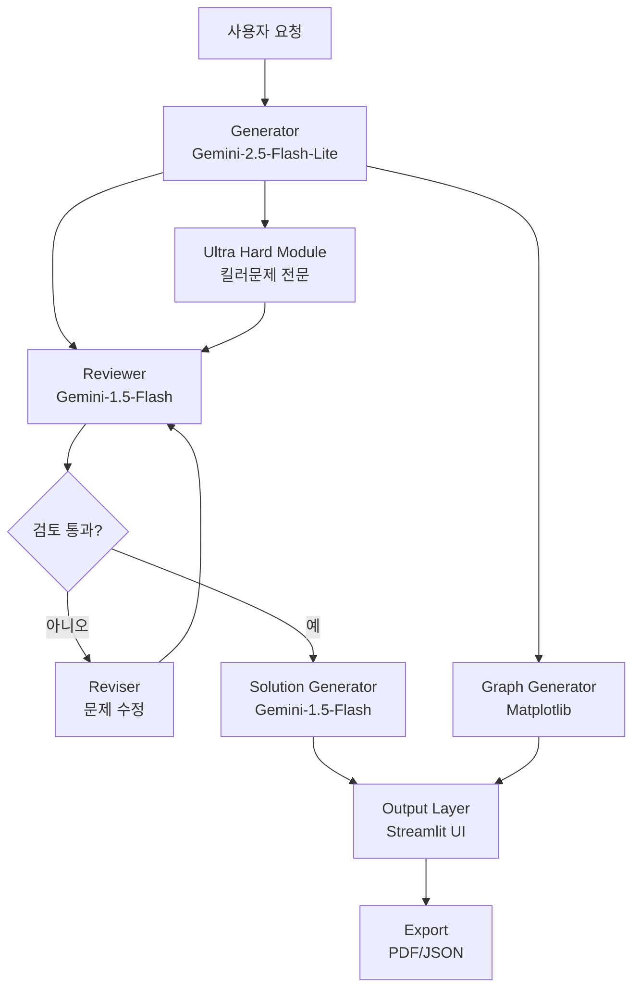

# 🎓 한국 수능 수학 AI 문제 생성 시스템

## 1. 개요
본 시스템은 한국 대학수학능력시험(수능) 스타일의 수학 문제를 자동 생성하고, 풀이와 해설까지 제공하는 AI 기반 문제 생성 시스템입니다.

### 핵심 모델
- **문제 생성**: Gemini-2.5-Flash-Lite (최신 모델)
- **문제 검토**: Gemini-2.5-Flash (검증 및 개선)
- **풀이 생성**: Gemini-2.5-Flash (상세 해설)

### 주요 특징
- 🚀 **3단계 생성 파이프라인**: 생성 → 검토 → 수정 아키텍처
- 📊 **그래프 생성**: 수학 함수 그래프 및 기하 도형 자동 생성
- 🎯 **초고난도 문제**: 수학1/수학2 단독 및 융합 킬러 문제 생성
- 📚 **2015 교육과정 준수**: 과목별 범위 엄격 준수
- 🔬 **초월함수 제한**: e^x, ln(x)는 미적분 과목에서만 사용
- 🎨 **LaTeX 렌더링**: 수식 완벽 지원
- 💡 **자동 풀이 생성**: 문제별 상세 해설 자동 생성

## 2. 시스템 아키텍처

### 2.1 아키텍처 개요



### 2.2 데이터 흐름
1. **사용자 입력**: 문제 생성 조건 설정 (과목, 주제, 난이도, 유형)
2. **문제 생성**: Gemini-2.5-Flash-Lite가 조건에 맞는 문제 생성
3. **문제 검토**: Gemini-1.5-Flash가 생성된 문제 검증
   - 교육과정 준수 여부
   - 수학적 정확성
   - 난이도 적절성
4. **문제 수정**: 검토 결과에 따라 자동 수정
5. **풀이 생성**: Gemini-2.5-Flash가 상세 해설 생성
6. **출력**: Streamlit UI에 표시 및 PDF/JSON 내보내기

## 3. 주요 모듈

### 3.1 문제 생성 모듈
#### 기본 생성기 (Gemini-2.5-Flash-Lite)
- **입력**: 과목, 주제, 난이도, 문제 유형
- **출력**: 문제 지문, 선택지, 정답
- **특징**: 2015 교육과정 자동 준수

#### 초고난도 생성기 (Ultra Hard Generator)
- **수학1 단독**: 지수/로그, 삼각함수, 수열 극한 문제
- **수학2 단독**: 미분, 적분, 함수 극한 문제
- **융합 문제**: 수학1+수학2 복합 개념
- **미적분 전용**: 매개변수/음함수/역함수 미분법
- **문제 패턴**:
  - 조건충족형
  - 다중개념융합
  - 불연속/미분불가능
  - 매개변수 문제
  - 극값개수 계산
  - 적분조건 문제
  - 수열/극한 응용

#### 검토 시스템 (Gemini with Review)
- **3단계 프로세스**: 생성 → 검토 → 수정
- **검토 항목**:
  - 문제 적절성 (1-10점)
  - 교육과정 준수
  - 수학적 정확성
  - 개선 제안사항

### 3.2 풀이 생성 모듈 (Solution Generator)
- **모델**: Gemini-2.5-Flash
- **기능**:
  - 단계별 상세 풀이
  - 핵심 개념 설명
  - 주의사항 및 팁
  - LaTeX 수식 포맷팅
- **자동 생성**: UI에서 풀이가 없는 경우 자동 생성

### 3.3 그래프 생성 모듈
- **지원 유형**:
  - 다항함수/유리함수
  - 삼각함수
  - 지수/로그함수 (미적분만)
  - 원뿔곡선 (포물선, 타원, 쌍곡선)
  - 벡터 및 공간도형
- **출력**: Base64 인코딩 이미지

### 3.4 UI 모듈 (Streamlit)
- **기능**:
  - 단일 문제 생성
  - 모의고사 세트 생성 (30문제)
  - 킬러 문제 전용 모드
  - 과목별 패턴 선택:
    - 수학1: 조건충족형, 지수로그 방정식, 삼각함수 극값 등
    - 수학2: 불연속/미분불가능, 극값개수, 적분조건 등
    - 미적분: 매개변수미분, 음함수미분, 역함수미분 등
  - PDF/JSON 내보내기
  - 실시간 풀이 생성

## 4. 기술 스택
| 구성요소 | 기술 |
|---------|------|
| 문제 생성 | Gemini-2.5-Flash-Lite API |
| 문제 검토 | Gemini-2.5-Flash API |
| 풀이 생성 | Gemini-2.5-Flash API |
| 웹 UI | Streamlit |
| PDF 출력 | ReportLab |
| 그래프 | Matplotlib, NumPy |
| 환경 관리 | Python-dotenv |

## 5. 최근 업데이트 (2025.09.06)

### 주요 개선사항
1. **아키텍처 개선**
   - Gemini API 기반 생성 → 검토 → 수정 파이프라인 구축
   - 불필요한 모듈 제거 (임베딩, Gemma, FAISS 등)
   - 경량화된 의존성 (PyTorch, Transformers 제거)

2. **울트라 하드 문항 확장**
   - 수학1, 수학2 단독 문항 생성 추가
   - 7가지 고난도 패턴 구현
   - 과목별 동적 패턴 선택 UI

3. **초월함수 제한**
   - e^x, ln(x)는 미적분 과목에서만 사용
   - 수학1, 수학2에서 자동 필터링

4. **풀이 생성 자동화**
   - Gemini API 기반 자동 풀이 생성
   - 풀이 누락 시 실시간 생성
   - 단계별 해설 및 핵심 개념 포함

5. **UI/UX 개선**
   - 풀이 표시 버그 수정
   - LaTeX 수식 렌더링 개선
   - 이스케이프 문자 처리 최적화

## 6. 프로젝트 구조
```
ksat-math-ai/
├── src/
│   ├── core/               # 핵심 모듈
│   │   ├── config.py       # 설정 관리
│   │   ├── problem_generator.py  # 메인 생성기
│   │   └── curriculum_2015.py    # 2015 교육과정
│   ├── generator/          # 생성 모듈
│   │   ├── gemini_client_v2.py   # Gemini API 클라이언트
│   │   ├── gemini_with_review.py # 검토 시스템
│   │   ├── solution_generator.py # 풀이 생성기
│   │   └── ultra_hard_generator.py # 킬러문제 생성
│   ├── generators/         # 특수 생성 모듈
│   │   ├── graph_generator.py    # 그래프 생성
│   │   ├── pdf_generator.py      # PDF 출력
│   │   └── ultra_hard_problems.py # 초고난도 템플릿
│   ├── ui/                 # UI 모듈
│   │   └── app.py          # Streamlit 메인
│   ├── utils/              # 유틸리티
│   │   └── helpers.py      # 헬퍼 함수
│   └── validators/         # 검증 모듈
│       ├── answer_mapper.py      # 답안 매핑
│       ├── choice_parser.py      # 선택지 파싱
│       ├── error_fixes.py        # 오류 수정
│       └── json_fixer.py         # JSON 수정
├── requirements.txt        # 의존성
├── .env                   # API 키 설정
└── README.md              # 프로젝트 문서
```

## 7. 설치 및 실행

### 7.1 환경 설정
```bash
# 저장소 클론
git clone https://github.com/yourusername/ksat-math-ai.git
cd ksat-math-ai

# 가상환경 생성 및 활성화
python -m venv venv
source venv/bin/activate  # Windows: venv\Scripts\activate

# 패키지 설치
pip install -r requirements.txt
```

### 7.2 API 키 설정
```bash
# .env 파일 생성
echo "GEMINI_API_KEY=your_gemini_api_key_here" > .env
```

### 7.3 실행
```bash
# Streamlit 앱 실행
streamlit run src/ui/app.py
```

## 8. 사용 방법

### 8.1 단일 문제 생성
1. 과목 선택 (수학1, 수학2, 미적분 등)
2. 주제 및 난이도 설정
3. 문제 유형 선택 (선택형/단답형)
4. "문제 생성" 클릭
5. 생성된 문제 및 자동 풀이 확인

### 8.2 킬러 문제 생성
1. "초고난도 문제 생성" 탭 선택
2. 융합 유형 선택:
   - 수학1 (단독)
   - 수학2 (단독)
   - 수학1+수학2 (융합)
   - 미적분 (초월함수 포함)
3. 문제 패턴 선택 (과목별 자동 필터링)
4. 생성 및 검토

### 8.3 모의고사 생성
1. "모의고사 생성" 탭 선택
2. 공통 과목 및 선택 과목 설정
3. 킬러 문제 포함 여부 선택
4. "모의고사 생성" 클릭 (약 2-3분 소요)
5. PDF 다운로드

## 9. 성능 지표
| 작업 | 처리 시간 | 비고 |
|------|-----------|------|
| 단일 문제 생성 | 2-5초 | Gemini API |
| 문제 검토 | 1-3초 | 검증 프로세스 |
| 풀이 생성 | 2-4초 | 자동 생성 |
| 모의고사 생성 | 2-3분 | 30문제 세트 |
| PDF 생성 | 5-10초 | ReportLab |

## 10. 주의사항
- Gemini API 키 필수
- 일일 API 호출 제한 확인 필요
- 생성된 문제의 최종 검토 권장
- 상업적 사용 시 라이선스 확인

## 11. 확장 계획
- **다양한 문제 유형**: 증명, 논술형 문제 추가
- **난이도 자동 조정**: 사용자 피드백 기반 난이도 보정
- **협업 기능**: 다중 사용자 문제 공유
- **학습 분석**: 오답 패턴 분석 및 맞춤 문제 추천

## 12. 라이선스
MIT License

## 13. 기여 방법
버그 리포트, 기능 제안, 풀 리퀘스트 환영합니다!

## 14. 문의
- Issues: [GitHub Issues](https://github.com/yourusername/ksat-math-ai/issues)
- Email: your.email@example.com